# Visit Bristol

[Live Website - Visit Bristol](https://pal772.github.io/Visit-Bristol/ "Live Website - Visit Bristol")

# Site Overview
Visit Bristol is a website that shows the top places to vist and to eat in Bristol.
It also has some information about the city, in the About content.
 
This site is aimed anyone looking to visit Bristol, and need some inspiration on places to visit, or a 
great place to eat.
 
This website is created as my very first milestone project for Code Institute.

# contents

* [Technologies Used](#technologies-used)
* [User Experience](#user-experience)
* [Features](#features)
    * [Existing Features](#existing-features)
* [Design](#design) 
    * [Wireframes](#wireframes)
    * [Images](#images)
* [Testing](#testing)
    * [Manual Testing](#manual-testing)
    * [Lighthouse Testing](#lighthouse-testing)
    * [Validator Testing](#validator-testing)
    * [Bugs](#bugs) 
    * [Deployment](#deployment)
* [Credits](#credits)  

## Technologies Used

* <a href="https://balsamiq.com/">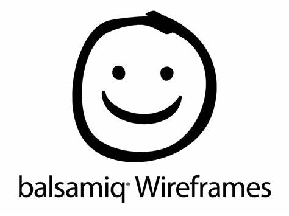</a>
  I used Balsamiq wireframe first, to make a rough sketch of my site in mobile, tablet and desktop form.
 

 *  
   HTML was used to construct the base of my website and structure.
  

 *  
   CSS was used to style my website and make it responsive. CSS and HTML were the core technologies i used to create a 
   image slider and gallery page.
  

 * <a href="https://fonts.google.com/">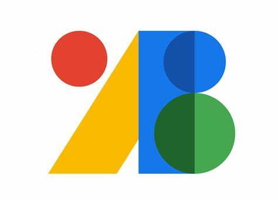</a>
   Used Google Fonts to style my website to make it look visually appealing.

 

### User Experience

- As a user, i wanted to find out what the website is about, as soon as I clicked on the home page.
- I wanted to be able to navigate the website easily, without getting lost and having to scroll to find my place.
- I also wanted to find out what the city had to offer, without having to search too long.
- It's also great to have images available without having to go to another page.
- I wanted to be able to see information about images in the gallery.

## Features

### Existing FeaturesS
- __Navigation Bar__
    - As a user, I want to be able to navigate the website easily.
    - The fully responsive navigation bar is featured in the upper right hand side of the website on each page, on 
      Home, Places to Eat and Gallery.
    - The current page you are on is underlined in the navigation bar, helping the user understand which part of the 
      website's page they're viewing.
    - You can access each page on the navigation bar, Home, Places to Eat and Gallery. 

    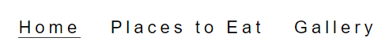
    
    
- __Main Image__
    - As soon as you click on the home page, the user automatically knows what the website is about.
    - The main image is a beautiful arial view of Bristol, as the sun sets.
    - It includes two headings to describe the name and summary of what the website entails.
     

    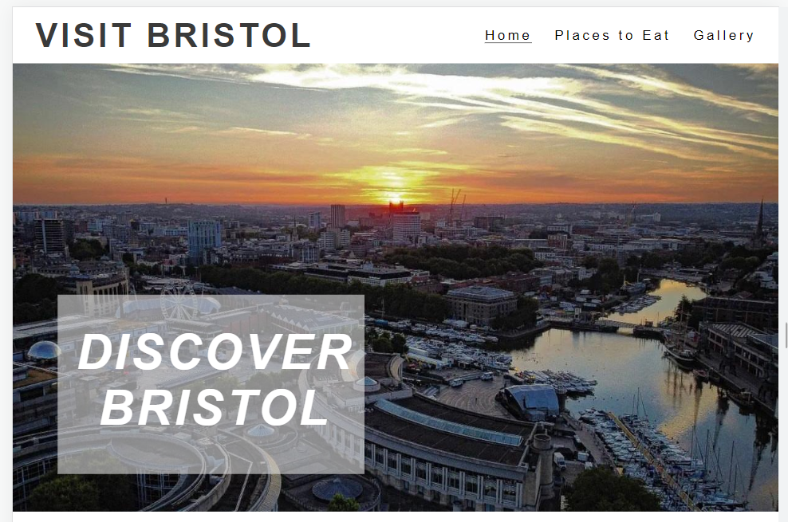   

 - __Information section__

    - As a user, i wanted to find out what Bristol had to offer.
    - The short summary, ABOUT BRISTOL expains the location, population of Bristol and brief insight into the city.
    - It mentions, main tourists places to visit and on the next page suggesions on places to eat.
     

    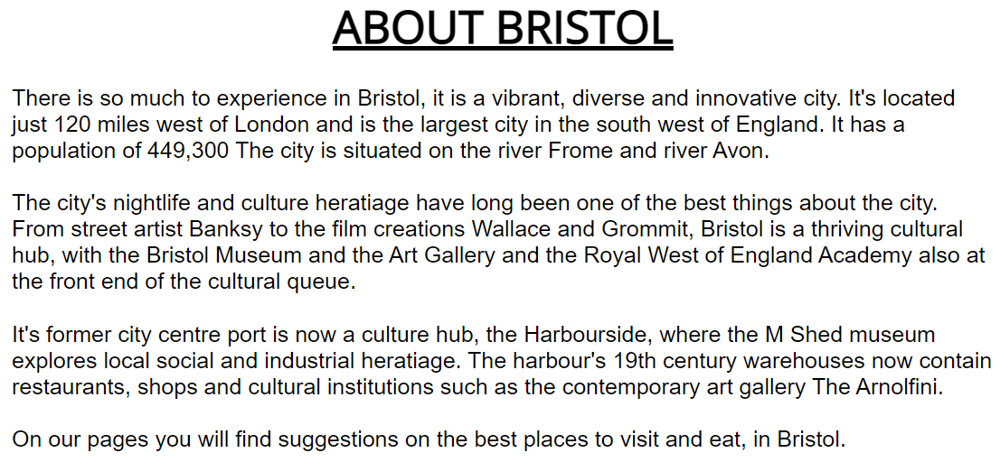  

- __Top places to visit in Bristol__

    - Sub-tite mentioning top places to visit in Bristol.

     

- __Top places to visit - image slider__

    - As a user, i wanted suggestions on the top places to Visit in Bristol.
    - As you scrowl down the home page, there are 5 image sliders.
    - Each image slider showcases a short gallery
    - Each image slider has a title and information about it.
    - Below the information there is a sub-title, with Contact details.
    - Contact detais, has a link to it's main website, location and telephone number.
    - This was created using just HTML and CSS.

    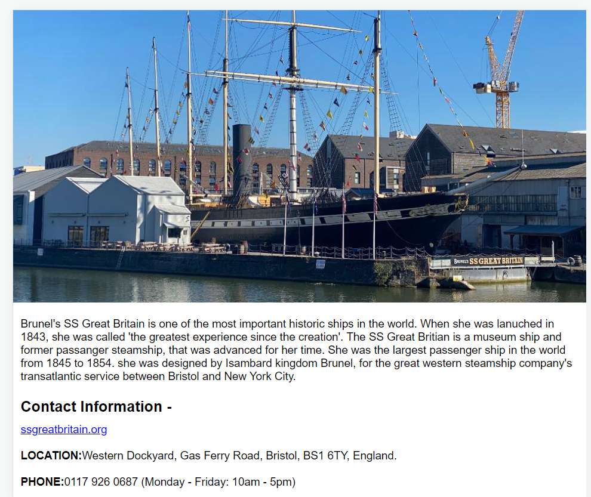  
 
     

- __Places To Eat - image__

    - As a user, if i'm visiting Bristol, i would also like to know a great place to eat.
    - As you click on the next page, there are 5 suggestions on where to eat.
    - The name of the restaurant is displayed, with its image.
    - The restaurant images were taken from [open table](https://www.opentable.co.uk/)
    - Each one has a description, of the type of food they serve.
    - Underneath the description there is a main link to each restaurant.

    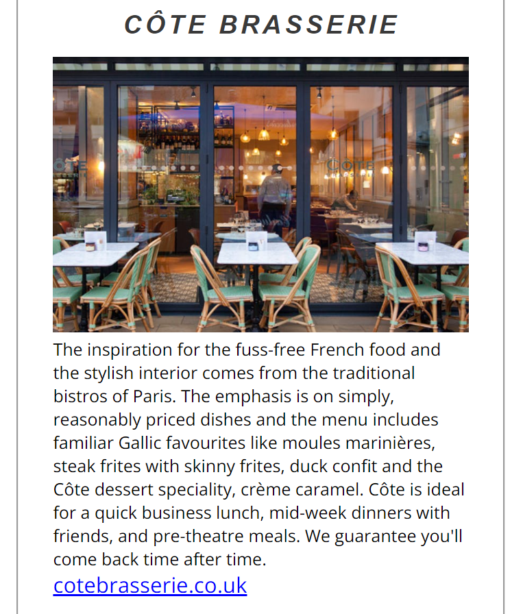  

     

- __Gallery Page__
    
    - As you click on the 'gallery page', it displays a few sites of Bristol.
    - Each image has a has a title.
    - They were all taken by me.

    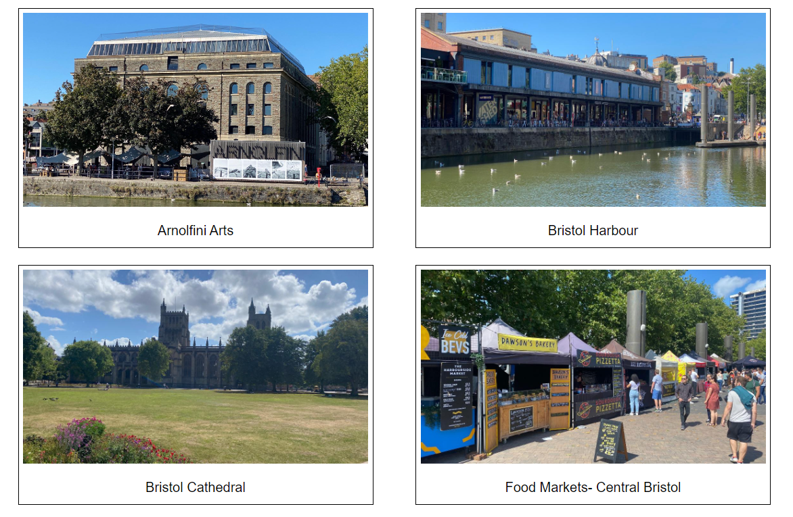  

     

- __Social Media Links__  
    
    - All 3 pages have the same footer.
    - And they all include links to social media.
    - The icons used on the footer was taken from [font awesome](https://fontawesome.com/)

  
     

 
  

## Design

- __Wire frames__  

    - I used Balsamiq to construct my wireframes for this project. Had a few initial rough ideas, but don't necessarily 
      reflect the finished website.

- __Fonts__ 

    - I wanted to keep the fonts looking simple and bold.
    - The fonts used on this webiste was used from [google fonts](https://fonts.google.com/)

- __Images__  

     - Created 5 image sliders on my home page to make the website more eye catching.
     - All 5 image sliders, the images were taken by me and in the Gallery page.
       As i live near Bristol, and new where to go.
     - The main image arial view of Bristol was taken from Yahoo Bristolimages.co.uk.
     - The restaurant images were taken from [open table](https://www.opentable.co.uk/)
     - The image gallery, i wanted to keep it simple and easy to use.

## Testing 

- __Lighthouse__  

     - When manual testing, i put it through Lighthouse.
     - Once i sorted out the bugs, it helped my wesite more responsive and improve my score, in Performance,
       Accessibility, Best Practices and SEQ.
     - As you can see in the final result below.

     
    
     - Used Dimention: Responsive - 966.40px x 745.60px medium devices

     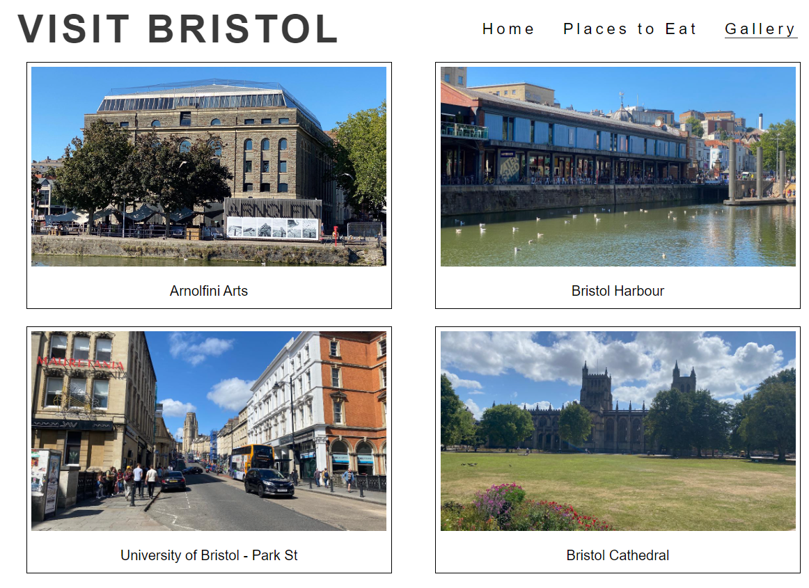 

     

     - Used Dimention: Responsive - 375 x 658 mobile devices

     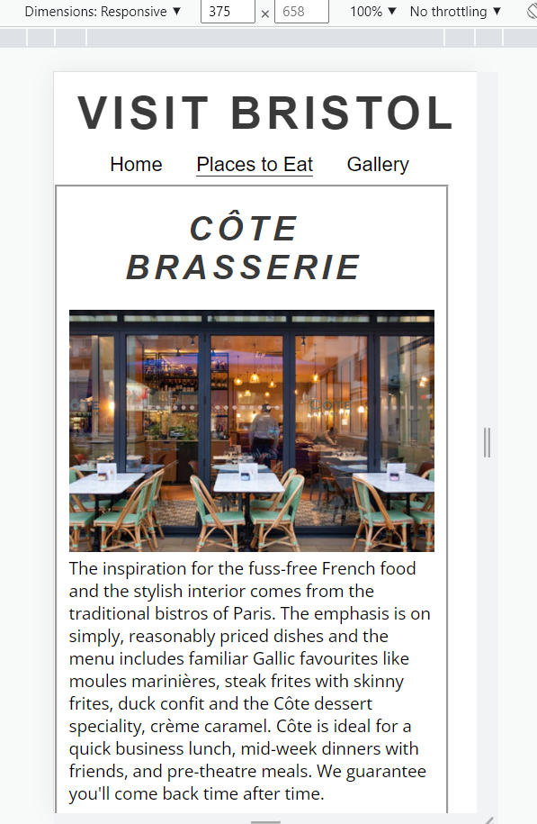  

      
- __Final Result__  
      
    - The colors and fonts chosen are easy to read and accessible by running it through Lighthouse.

    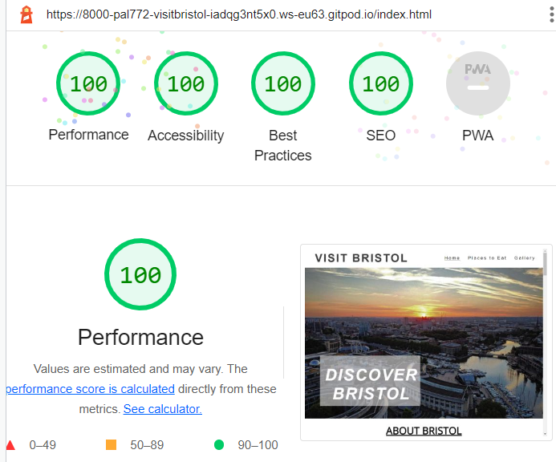  

     

- __Validator Testing__ 

     - Index Page 

     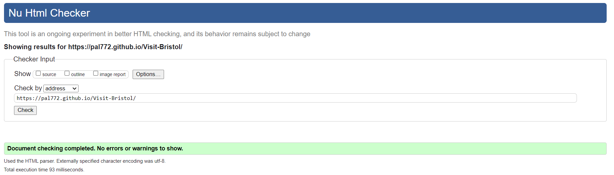 

     - Places to Eat page

     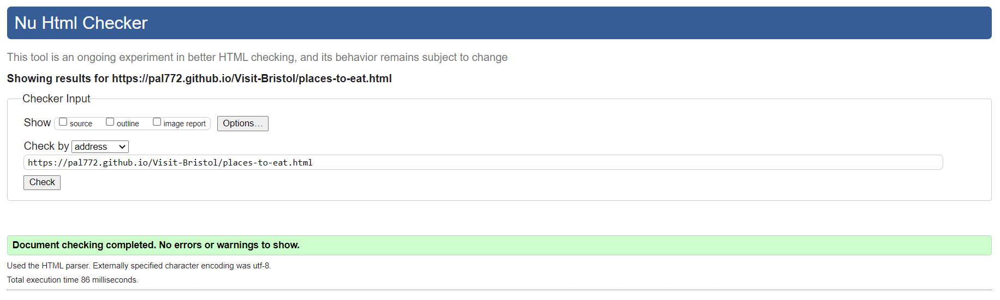 

     - Gallery page

     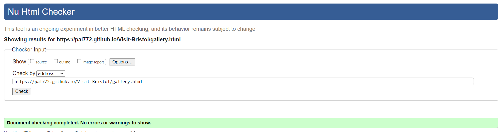  

- __CSS__  
     - Errors all sorted, when passed it through the official[ jigsaw validator](https://jigsaw.w3.org/css-validator/)

    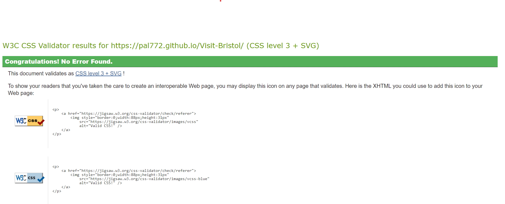

## Bugs

  - When i was manual testing on Lighthouse, my mentor noticed a few errors with my headings, which i 
    arranged correctly.
  - When trying to make it responsive on Lighthouse, on mobile devices the image slider were too big.
    With help from my mentor, got sorted out. 
  - Also the image slider, wasnt changing images, had some advice on Slack.
  - My Gallery was displaying all of my images in a row. Was advised to use flex-contain by fellow mentors on Slack.
  - When passing it through the official [ jigsaw validator](https://jigsaw.w3.org/css-validator/), had a <width=100%> 
    on my HTML page (img src) Places to Eat.
     
    With help from Student Tutoring, got sorted by adding it onto Media Queries.
 

   

   ## Deployment

   ### Visit Bristol was deployed on Github pages. The process are as follows -

  - Went to the project's repository and navigated to the 'Settings' tab in the far right.
  - I scrolled down to the 'Code and automation' section and clicked into the 'Pages' tab.
  - Under 'source', I used the drop down menu to select 'main' and then clicked save.
  - Then i  received a message indicating the deployment had been successful.

  The live link can be found below:
  
  [Live Website - Visit Bristol](https://pal772.github.io/Visit-Bristol/ "Live Website - Visit Bristol")

## Credits

### Content
  - The main image on readme was designed using[ am i responsive](https://ui.dev/amiresponsive)
  - The Main image design was similar to the Love running project on Code insitite.
  - The fonts used on this webiste was used from [google fonts](https://fonts.google.com/)
  - The main arial view image of Bristol was taken from 'Yahoo Bristolimages.co.uk'.
  - The restaurant images were taken from [open table](https://www.opentable.co.uk/)
  - Rest of the images were taken by me.
  - The instrctions on how to make an image slider were taken from [specific youtube tutorial](https://www.youtube.com/)
  - The instrctions on how i designed my gallery were taken from [specific youtube tutorial](https://www.youtube.com/)
  - The icons used on the footer was taken from [font awesome](https://fontawesome.com/)

